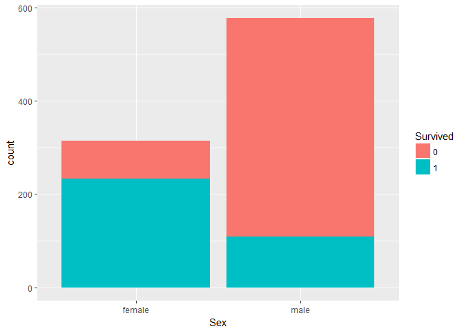
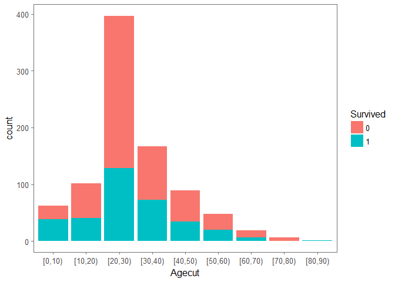
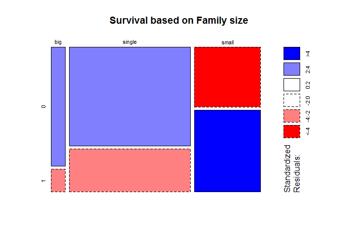
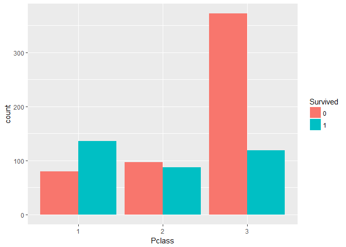

Titanic
================

``` r
library(dplyr)
library(ggplot2)
library(ggthemes)
library('scales')
titanic= read.csv("D://train.csv")
```

``` r
summary(titanic)
```

    ##   PassengerId       Survived          Pclass     
    ##  Min.   :  1.0   Min.   :0.0000   Min.   :1.000  
    ##  1st Qu.:223.5   1st Qu.:0.0000   1st Qu.:2.000  
    ##  Median :446.0   Median :0.0000   Median :3.000  
    ##  Mean   :446.0   Mean   :0.3838   Mean   :2.309  
    ##  3rd Qu.:668.5   3rd Qu.:1.0000   3rd Qu.:3.000  
    ##  Max.   :891.0   Max.   :1.0000   Max.   :3.000  
    ##                                                  
    ##                                     Name         Sex           Age       
    ##  Abbing, Mr. Anthony                  :  1   female:314   Min.   : 0.42  
    ##  Abbott, Mr. Rossmore Edward          :  1   male  :577   1st Qu.:20.12  
    ##  Abbott, Mrs. Stanton (Rosa Hunt)     :  1                Median :28.00  
    ##  Abelson, Mr. Samuel                  :  1                Mean   :29.70  
    ##  Abelson, Mrs. Samuel (Hannah Wizosky):  1                3rd Qu.:38.00  
    ##  Adahl, Mr. Mauritz Nils Martin       :  1                Max.   :80.00  
    ##  (Other)                              :885                NA's   :177    
    ##      SibSp           Parch             Ticket         Fare       
    ##  Min.   :0.000   Min.   :0.0000   1601    :  7   Min.   :  0.00  
    ##  1st Qu.:0.000   1st Qu.:0.0000   347082  :  7   1st Qu.:  7.91  
    ##  Median :0.000   Median :0.0000   CA. 2343:  7   Median : 14.45  
    ##  Mean   :0.523   Mean   :0.3816   3101295 :  6   Mean   : 32.20  
    ##  3rd Qu.:1.000   3rd Qu.:0.0000   347088  :  6   3rd Qu.: 31.00  
    ##  Max.   :8.000   Max.   :6.0000   CA 2144 :  6   Max.   :512.33  
    ##                                   (Other) :852                   
    ##          Cabin     Embarked
    ##             :687    :  2   
    ##  B96 B98    :  4   C:168   
    ##  C23 C25 C27:  4   Q: 77   
    ##  G6         :  4   S:644   
    ##  C22 C26    :  3           
    ##  D          :  3           
    ##  (Other)    :186

``` r
str(titanic)
```

    ## 'data.frame':    891 obs. of  12 variables:
    ##  $ PassengerId: int  1 2 3 4 5 6 7 8 9 10 ...
    ##  $ Survived   : int  0 1 1 1 0 0 0 0 1 1 ...
    ##  $ Pclass     : int  3 1 3 1 3 3 1 3 3 2 ...
    ##  $ Name       : Factor w/ 891 levels "Abbing, Mr. Anthony",..: 109 191 358 277 16 559 520 629 417 581 ...
    ##  $ Sex        : Factor w/ 2 levels "female","male": 2 1 1 1 2 2 2 2 1 1 ...
    ##  $ Age        : num  22 38 26 35 35 NA 54 2 27 14 ...
    ##  $ SibSp      : int  1 1 0 1 0 0 0 3 0 1 ...
    ##  $ Parch      : int  0 0 0 0 0 0 0 1 2 0 ...
    ##  $ Ticket     : Factor w/ 681 levels "110152","110413",..: 524 597 670 50 473 276 86 396 345 133 ...
    ##  $ Fare       : num  7.25 71.28 7.92 53.1 8.05 ...
    ##  $ Cabin      : Factor w/ 148 levels "","A10","A14",..: 1 83 1 57 1 1 131 1 1 1 ...
    ##  $ Embarked   : Factor w/ 4 levels "","C","Q","S": 4 2 4 4 4 3 4 4 4 2 ...

``` r
titanic$Survived= as.factor(titanic$Survived)
titanic$Pclass= as.factor(titanic$Pclass)
```

``` r
titanic$Age[is.na(titanic$Age)] = mean(titanic$Age, na.rm=TRUE)
```

``` r
titanic$Agecut = cut(titanic$Age, breaks = seq(0,100,10), right = FALSE)
```

Survival chances based on gender
================================

``` r
ggplot(titanic, aes(x=Sex, fill=Survived)) + geom_bar()
```



> Chances for surival are higher for females, compared to the males, as the females were given higher priority while being rescued.

Survival chances based on age
=============================

``` r
ggplot(titanic, aes(x = Agecut, fill = Survived)) +
  geom_bar(stat='count', position='stack') +
  theme_few()
```



> The survival chances of kids aged till 10, are higher as they were rescued. Whereas, very less chance for the elderly aged between 60-80, as it will be difficult for them to face the situation.

The survival chances based on Family size.
==========================================

``` r
titanic$Family = titanic$SibSp + titanic$Parch + 1

titanic$Family_s[titanic$Family == 1] <- 'single'
titanic$Family_s[titanic$Family < 5 & titanic$Family > 1] <- 'small'
titanic$Family_s[titanic$Family > 4] <- 'big'


mosaicplot(table(titanic$Family_s, titanic$Survived), main='Survival based on Family size', shade=TRUE)
```



> Here we are creating families based by adding Parentchild, SiblingsSpouse and adding + 1 for the person himself. We classified them as single, small family(1-4 persons) and big family(more than 4 persons). The survival chances for singles and people with big families are less, whereas high for people with samll families. It may be due to these reasons. For singles, people with families were priorotized while being rescued. For people with big familes it was difficult to survive as they had to first rescue their whole family. For people with small families it was easy to survive

Survival chances for people based on their travel class
=======================================================

``` r
ggplot(titanic, aes(x=Pclass, fill= Survived)) + geom_bar(position = 'dodge')
```



> The chances of survival for people as we can see is dependent on their travel class. People travelling in higher class have higher chances of survival, than people with lower class.
